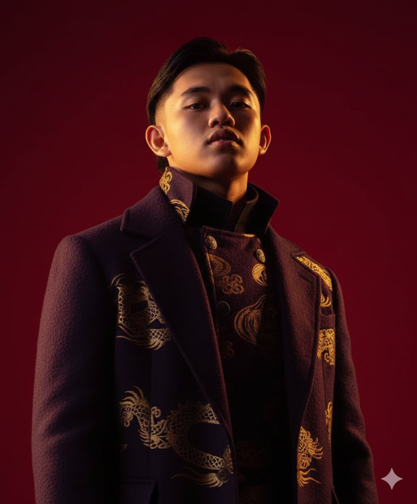

# 🌟 Portfolio — Full-Stack Developer

Website portofolio premium dengan tampilan enterprise, dark/light mode, dan animasi GSAP.

---

## 📁 Struktur File

```
portfolio/
├── index.html          ← File utama (buka ini di browser)
├── css/
│   └── style.css       ← Semua styling & dark/light mode
├── js/
│   ├── data.js         ← Edit data projects & sertifikat di sini
│   └── main.js         ← Logic animasi, modal, filter
├── assets/             ← Taruh foto profil & screenshot project di sini
└── README.md
```

---

## 🚀 Cara Menggunakan

### 1. Buka di Browser
Cukup double-click `index.html` — tidak perlu server!

### 2. Ganti Informasi Pribadi
Edit `index.html`, cari dan ganti:
- **"Arya Renata"** → Nama kamu
- **"arya@example.com"** → Email kamu
- **"linkedin.com/in/arya"** → LinkedIn kamu
- **"github.com/arya-dev"** → GitHub kamu
- **"@arya_builds"** → Twitter/X kamu
- **"Surabaya, Indonesia"** → Kota kamu

### 3. Tambah Foto Profil
1. Taruh file foto di folder `assets/` (contoh: `assets/photo.jpg`)
2. Di `index.html`, cari `hex-avatar-placeholder` dan ganti dengan:
```html

```

### 4. Edit Projects
Buka `js/data.js` dan edit array `PROJECTS`:
```js
{
  id: 1,
  title: "Nama Project",
  category: "fullstack",        // fullstack | frontend | backend | mobile
  tags: ["React", "Node.js"],
  desc: "Deskripsi project...",
  icon: "🚀",                   // emoji sebagai placeholder
  screenshot: "assets/project-1.jpg",  // path screenshot (opsional)
  features: ["Fitur 1", "Fitur 2"],
  demo: "https://link-demo.com",
  github: "https://github.com/kamu/project",
  year: "2024"
}
```

### 5. Edit Sertifikat
Di `js/data.js`, edit array `CERTIFICATES`:
```js
{
  id: "cert-1",
  name: "Nama Sertifikat",
  issuer: "Penerbit",
  date: "2024-03",        // format YYYY-MM
  credId: "ABC-12345",    // credential ID (opsional)
  desc: "Deskripsi...",
  icon: "☁"              // emoji
}
```

Atau gunakan tombol **"+ Add Certificate"** langsung di website!

---

## ✨ Fitur

| Fitur | Keterangan |
|-------|-----------|
| 🌙 Dark / Light Mode | Toggle di navbar, tersimpan di localStorage |
| 🔷 Hexagon Profile Frame | Rotating border emas + partikel animasi |
| ⚡ GSAP Animations | Stagger entrance, scroll-triggered, counter |
| 🗂 Project Filter | Filter by kategori (All / Full-Stack / Frontend / Backend / Mobile) |
| 🖥 Project Modal | Preview + Live Demo + GitHub links |
| 🏆 Certificate Flip Cards | Hover untuk lihat detail |
| ➕ Add Certificate | Form tambah sertifikat baru langsung di UI |
| 📱 Responsive | Mobile-friendly |

---

## 🎨 Kustomisasi Warna

Edit variabel di `css/style.css` bagian `:root` (dark mode) dan `[data-theme="light"]`:

```css
:root {
  --gold:   #c9a84c;   /* warna emas utama */
  --accent: #7c6fff;   /* warna ungu aksen */
  --teal:   #4ecdc4;   /* warna teal/cyan */
}
```

---

## 📦 Deploy

Website ini adalah **pure HTML/CSS/JS** — bisa di-deploy ke:
- **GitHub Pages** — gratis, upload ke repo lalu enable Pages
- **Netlify** — drag & drop folder ke netlify.com
- **Vercel** — `vercel deploy`
- **cPanel/Hosting** — upload via File Manager

---

*Built with HTML, CSS, JavaScript, GSAP*
